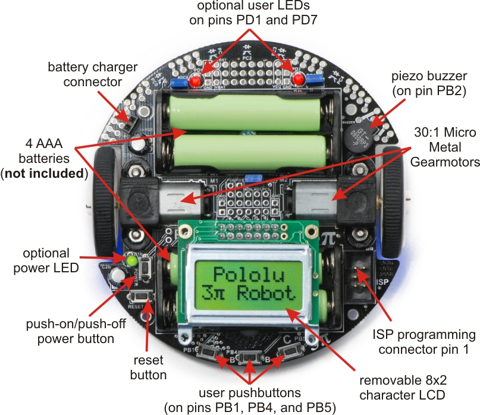
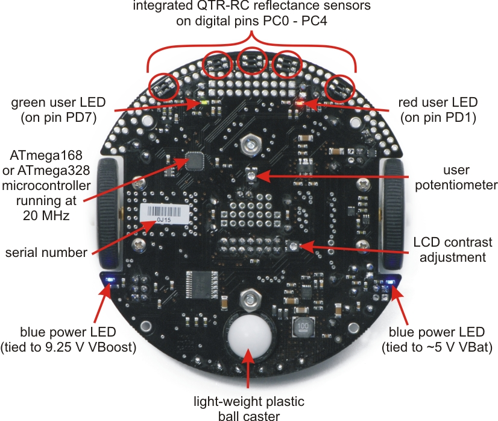

# Polulu Robot 3Pi Mine Detection Project

## Overview
This project utilizes the Polulu 3Pi Robot to identify mines within an x-y coordinate system. Sensors positioned at the front base of the robot detect colors to locate mines. Users can set the desired number of mines to detect by using the left button to decrement and the right button to increment. Pressing the middle button initiates the mine detection process. The robot employs color changes detected by sensors at a specific point in time to identify mines, followed by a 360-degree spin upon detection. Real-time sensor states, indicated as 'b' for black and 'w' for white, are displayed. Overcoming the robot's sensitivity, a counter ensures continued monitoring for a specific time to reduce false positives. Potential improvements include implementing autocorrection during initial movement to account for user-induced pressure and enhance navigation through the minefield.

## How to Install
1. Download the code from Github and open it in your preferred code editor (e.g. Visual Studio Code)
2. Insert four AAA batteries into the Polulu 3Pi Robot and attach the LCD display.
3. Connect your robot to a USB AVR Programmer using a 6-pin ISP programming cable.
4. Connect the USB AVR Programmer to a laptop or computer using a mini-B to USB A cord.
5. Turn on the robot by pressing the power button located on the left side of the LCD display.
6. Run the provided makefile and wait until the robot is fully programmed before disconnecting the 6-pin ISP cable from the robot.
7. Input the number of mines you would like the robot to detect using the left and right buttons.
8. Press on the middle button when you have reached the desired value as shown on the LCD display.
9. Ensure the robot is placed flat on a hard surface with no obstacles nearby before pressing the middle button to set the coordinates.
10. Wait until the robot has stopped before picking it up. You can restart the process using the rest button or turn it off using the power button. Good luck!

## Visual Aid

  
  

A top and bottom view of the Polulu Robot 3Pi. Images were taken from https://www.pololu.com/product/975

## Credits
- Partner: [Christopher Ghim](https://www.linkedin.com/in/christopher-ghim-bb1218223/)
- [Description of Polulu Robot 3Pi Functions](https://www.pololu.com/product/975)

- Purchase Links are shown here:
  - [Polulu 3Pi](https://www.bananarobotics.com/shop/Pololu-3pi-Robot)
  - [Polulu USB AVR Programmer](https://www.pololu.com/product/1300)
  - [USB Cable A to Mini-B, 5ft](https://www.pololu.com/product/1315)
  - [6-Conductor Ribbon Cable with IDC Connector 12"](https://www.pololu.com/product/972)
